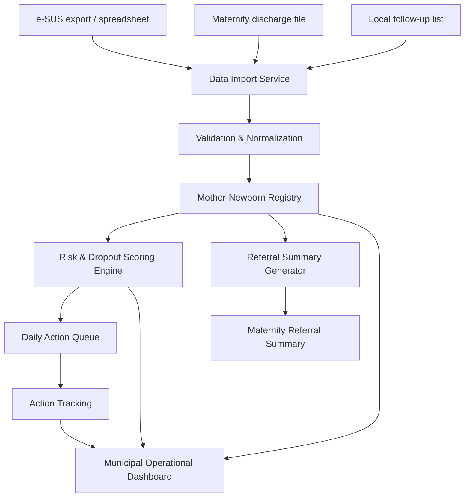

# Technical Specification — SINAL-MI

## 1. Technical Overview
> **Presenter side note:** Present this section as: The technical approach mirrors the product strategy: lightweight, explainable, and delivery-ready.
> **What led you to think of this and formulate this strategy or solution?** The technical approach mirrors the product strategy: lightweight, explainable, and delivery-ready. I avoided architecture that depends on large integrations before proving operational value.

SINAL-MI is a lightweight AI-enabled web application that consolidates maternal and newborn data from fragmented sources and converts it into operational tasks.

The first phase is designed for fast delivery by a small team:

- 1 AI Solutions Engineer
- 1 Full Stack Developer
- Product Manager / consultant lead
- Municipal counterparts and frontline users

The system should not depend on deep integrations in phase one. It should support structured uploads and be designed for future integration.

---

## 2. Architecture Principles
> **Presenter side note:** Present this section as: These principles keep engineering decisions aligned with public-sector constraints.
> **What led you to think of this and formulate this strategy or solution?** These principles keep engineering decisions aligned with public-sector constraints. The goal is to build something secure and useful even with messy data and uneven facility capacity.

1. **Lightweight ingestion first**  
   Use CSV/Excel and structured exports before real-time APIs.

2. **Modular design**  
   Separate ingestion, scoring, task generation, referral summary generation, and dashboard layers.

3. **Human-in-the-loop AI**  
   AI prioritizes and summarizes; humans decide and act.

4. **Explainability by default**  
   Every risk score must include reason codes.

5. **Privacy and security by design**  
   Maternal and newborn health data is sensitive and must be protected.

---

## 3. Proposed Technical Stack
> **Presenter side note:** Present this section as: The stack favors common, maintainable technologies a small team can ship quickly.
> **What led you to think of this and formulate this strategy or solution?** The stack favors common, maintainable technologies a small team can ship quickly. I chose tools that support web workflows, structured data, auditability, and future integrations.

### Frontend

- React or Next.js
- Responsive web interface
- Role-based views for nurse, community health agent, UBS manager, hospital referral user, and municipal coordinator

### Backend

- Python/FastAPI or Node.js/NestJS
- REST API
- Background job processor for imports and scoring

### Database

- PostgreSQL
- Structured relational model for patient, pregnancy, newborn, risk score, tasks, referrals, and audit logs

### AI / Analytics Layer

- Phase 1:
  - deterministic rules;
  - explainable scoring;
  - threshold-based prioritization;
  - controlled LLM summarization for referral summaries.
- Phase 1.5:
  - predictive modeling if historical data quality is validated.

### Hosting

- Cloud environment approved by the municipality or secure project environment
- Encrypted storage
- Environment separation: development, staging, production

---

## 4. High-Level Architecture
> **Presenter side note:** Present this section as: The architecture creates an operational layer above fragmented sources.
> **What led you to think of this and formulate this strategy or solution?** The architecture creates an operational layer above fragmented sources. This lets the city start with imports now while leaving room for APIs and deeper interoperability later.



---

## 5. Data Sources for Phase One
> **Presenter side note:** Present this section as: The prompt made clear that data lives in multiple places.
> **What led you to think of this and formulate this strategy or solution?** The prompt made clear that data lives in multiple places. I designed ingestion around the reality of exports, spreadsheets, and discharge files rather than assuming clean system access.

### Supported sources

1. e-SUS primary care export
2. Local UBS spreadsheets
3. Maternity hospital discharge files
4. Manual follow-up lists from UBS or community health teams

### Ingestion method

- File upload in CSV/XLSX format
- Template-based mapping
- Required field validation
- Duplicate detection
- Missing data flags
- Import history log

### Future integration path

- API-based e-SUS integration
- hospital system integration
- automated daily imports
- message platform integration, if approved

---

## 6. Minimum Data Model
> **Presenter side note:** Present this section as: The data model focuses on the minimum entities needed to connect mother, baby, risk, referral, and action.
> **What led you to think of this and formulate this strategy or solution?** The data model focuses on the minimum entities needed to connect mother, baby, risk, referral, and action. This avoids over-modeling while supporting the MVP workflow end to end.

### Entity: User

| Field | Type | Notes |
|---|---|---|
| id | UUID | Primary key |
| name | string | User display name |
| email | string | Login identity |
| role | enum | nurse, CHW, UBS manager, hospital, coordinator, admin |
| ubs_id | UUID | Nullable for municipal-level users |
| created_at | timestamp |  |
| updated_at | timestamp |  |

---

### Entity: Facility

| Field | Type | Notes |
|---|---|---|
| id | UUID | Primary key |
| name | string | UBS or maternity name |
| type | enum | UBS, maternity, municipal |
| neighborhood | string | Optional |
| active | boolean |  |

---

### Entity: Patient

| Field | Type | Notes |
|---|---|---|
| id | UUID | Primary key |
| local_patient_id | string | e-SUS or local identifier |
| name | string |  |
| date_of_birth | date |  |
| cpf_or_cns | string | Optional, if available |
| phone_primary | string | Optional |
| phone_secondary | string | Optional |
| alternative_contact_name | string | Optional |
| alternative_contact_relation | string | Optional |
| neighborhood | string | Optional |
| ubs_id | UUID | Linked facility |
| contact_reliability | enum | stable, unstable, unknown |
| created_at | timestamp |  |
| updated_at | timestamp |  |

---

### Entity: PregnancyEpisode

| Field | Type | Notes |
|---|---|---|
| id | UUID | Primary key |
| patient_id | UUID | Mother |
| status | enum | active, delivered, closed, lost_to_followup |
| gestational_age_weeks | integer | Current known value |
| estimated_due_date | date | Optional |
| prenatal_start_date | date | Optional |
| prenatal_visit_count | integer |  |
| last_prenatal_visit_date | date | Optional |
| missed_visit_count | integer |  |
| hypertension_flag | boolean |  |
| anemia_flag | boolean |  |
| adolescent_pregnancy_flag | boolean |  |
| previous_c_section_flag | boolean |  |
| formal_high_risk_flag | boolean | From existing records |
| last_contact_date | date | Optional |
| created_at | timestamp |  |
| updated_at | timestamp |  |

---

### Entity: BirthEpisode

| Field | Type | Notes |
|---|---|---|
| id | UUID | Primary key |
| mother_patient_id | UUID | Mother |
| delivery_date | date |  |
| maternity_id | UUID |  |
| discharge_date | date | Optional |
| delivery_type | enum | vaginal, c_section, unknown |
| complications_text | text | Optional |
| referral_source | string | Optional |
| created_at | timestamp |  |

---

### Entity: Newborn

| Field | Type | Notes |
|---|---|---|
| id | UUID | Primary key |
| mother_patient_id | UUID |  |
| birth_episode_id | UUID | Optional |
| birth_date | date |  |
| discharge_date | date | Optional |
| first_followup_completed | boolean |  |
| first_followup_date | date | Optional |
| newborn_risk_flags | jsonb | Optional |
| created_at | timestamp |  |
| updated_at | timestamp |  |

---

### Entity: RiskScore

| Field | Type | Notes |
|---|---|---|
| id | UUID | Primary key |
| patient_id | UUID |  |
| episode_type | enum | pregnancy, postpartum, newborn |
| clinical_score | integer | 0-100 |
| interruption_score | integer | 0-100 |
| combined_score | integer | 0-100 |
| priority_level | enum | red, orange, yellow, green |
| explanation_json | jsonb | Reason codes |
| generated_at | timestamp |  |

---

### Entity: ActionTask

| Field | Type | Notes |
|---|---|---|
| id | UUID | Primary key |
| patient_id | UUID |  |
| related_episode_type | enum | pregnancy, postpartum, newborn |
| ubs_id | UUID |  |
| assigned_to_role | enum | nurse, CHW, manager |
| assigned_to_user_id | UUID | Optional |
| action_type | enum | call, schedule_visit, home_visit, referral_review, postpartum_followup, newborn_followup |
| priority_level | enum | red, orange, yellow, green |
| due_date | date |  |
| status | enum | pending, contacted, appointment_scheduled, visit_planned, visit_completed, referred, unable_to_contact, escalated, resolved |
| notes | text | Optional |
| created_at | timestamp |  |
| updated_at | timestamp |  |

---

### Entity: ReferralSummary

| Field | Type | Notes |
|---|---|---|
| id | UUID | Primary key |
| patient_id | UUID |  |
| destination_facility_id | UUID | Optional |
| generated_text | text | AI-assisted summary |
| source_data_snapshot | jsonb | Data used to generate summary |
| reviewed_by_user_id | UUID | Optional |
| generated_at | timestamp |  |

---

### Entity: AuditLog

| Field | Type | Notes |
|---|---|---|
| id | UUID | Primary key |
| user_id | UUID |  |
| action | string |  |
| entity_type | string |  |
| entity_id | UUID |  |
| timestamp | timestamp |  |
| metadata | jsonb | Optional |

---

## 7. Risk Scoring Engine
> **Presenter side note:** Present this section as: The scoring engine starts explainable by design.
> **What led you to think of this and formulate this strategy or solution?** The scoring engine starts explainable by design. I chose rules and transparent weights first because trust and clinical review matter more than model sophistication in phase one.

### 7.1 MVP Approach

The first version should use explainable rules rather than a black-box model.

Reasons:

- data quality is uncertain;
- clinical users need trust;
- the team is small;
- the product must be delivered quickly;
- score tuning should happen with municipal and clinical stakeholders.

### 7.2 Score Types

#### Clinical Risk Score

Captures known maternal/newborn health risk signals.

Examples:

- hypertension;
- anemia;
- adolescent pregnancy;
- previous C-section;
- formal high-risk flag;
- late prenatal start;
- low prenatal visit count;
- postpartum follow-up gap;
- newborn follow-up gap.

#### Care Interruption Risk Score

Captures likelihood that care continuity may break.

Examples:

- missed appointment;
- multiple missed appointments;
- no contact in 14 days;
- unstable phone access;
- uses relative’s phone;
- third trimester without recent follow-up;
- postpartum without scheduled return;
- newborn without documented first-month follow-up.

### 7.3 Priority Logic

Initial priority levels:

| Combined Score | Priority | SLA |
|---:|---|---|
| 70+ | Red | Action today |
| 50-69 | Orange | Action within 48 hours |
| 30-49 | Yellow | Action within 7 days |
| <30 | Green | Monitor |

### 7.4 Explainability Output

Each score must return reason codes:

```json
{
  "priority_level": "red",
  "clinical_score": 65,
  "interruption_score": 72,
  "combined_score": 70,
  "reasons": [
    "Hypertension registered",
    "34 weeks pregnant",
    "Missed last prenatal visit",
    "No documented contact in 14 days"
  ],
  "recommended_action": "Call today and assess need for referral review"
}
```

### 7.5 Manual Override

Users with nurse/manager roles can manually override a priority level with a required reason.

---

## 8. Referral Summary Generator
> **Presenter side note:** Present this section as: This is the safest use of generative AI in the MVP.
> **What led you to think of this and formulate this strategy or solution?** This is the safest use of generative AI in the MVP. It saves time and improves referral completeness without allowing the model to invent facts or make clinical decisions.

### Purpose

Create a concise referral summary for maternity hospital staff using available structured data.

### Allowed Use

- Summarize known facts.
- Highlight missing information.
- Format data clearly.
- Reduce manual preparation time.

### Not Allowed

- Diagnose.
- Prescribe.
- Create unsupported facts.
- Recommend clinical treatment.
- Hide missing data.

### Prompt Pattern

The AI should receive structured data and strict instructions:

```text
You are generating a referral summary for clinical handoff.
Use only the structured data provided.
Do not invent information.
If information is missing, explicitly say "Not available in record."
Do not provide diagnosis or treatment advice.
Return a concise summary with sections:
1. Patient
2. Pregnancy/Postpartum/Newborn Status
3. Key Risk Factors
4. Recent Care Gaps
5. Reason for Referral
6. Contact and UBS Information
```

### Human Review

All generated summaries must be reviewed by a user before use.

---

## 9. API Specification
> **Presenter side note:** Present this section as: The API boundaries match the product modules so the team can build incrementally.
> **What led you to think of this and formulate this strategy or solution?** The API boundaries match the product modules so the team can build incrementally. Each endpoint supports a clear capability: import, view, prioritize, act, summarize, or monitor.

### Authentication

```http
POST /auth/login
POST /auth/logout
GET /auth/me
```

### Imports

```http
POST /imports/esus
POST /imports/spreadsheet
POST /imports/maternity-discharge
GET /imports
GET /imports/{id}
```

### Patients

```http
GET /patients
GET /patients/{id}
GET /patients/{id}/timeline
PATCH /patients/{id}
```

### Risk

```http
POST /risk/run
GET /risk/{patient_id}
GET /risk/latest?ubs_id={ubs_id}
```

### Daily Queue

```http
GET /queues/daily?ubs_id={ubs_id}
GET /queues/daily?priority=red
GET /queues/municipal
```

### Tasks

```http
POST /tasks
PATCH /tasks/{id}
GET /tasks?ubs_id={ubs_id}
GET /tasks?status=overdue
```

### Referral Summaries

```http
POST /referrals/summary
GET /referrals/{id}
PATCH /referrals/{id}/review
```

### Dashboard

```http
GET /dashboard/municipal
GET /dashboard/ubs/{id}
```

### Audit

```http
GET /audit-log
```

---

## 10. Role-Based Access
> **Presenter side note:** Present this section as: Health data is sensitive, so access must follow the user’s role and facility context.
> **What led you to think of this and formulate this strategy or solution?** Health data is sensitive, so access must follow the user’s role and facility context. I included RBAC early because privacy cannot be patched in after adoption.

| Role | Access |
|---|---|
| Community Health Agent | Assigned queue items, action updates, limited patient contact info |
| Nurse | UBS patient list, scoring explanation, action queue, task management, referral summary |
| UBS Manager | UBS dashboard, overdue actions, user activity |
| Hospital Referral User | Referral summaries for referred patients |
| Municipal Coordinator | Cross-UBS dashboard, aggregate metrics, pilot performance |
| Admin | User management, import templates, configuration |

---

## 11. Privacy, Security, and Governance
> **Presenter side note:** Present this section as: This section shows that AI in healthcare needs controls, not just features.
> **What led you to think of this and formulate this strategy or solution?** This section shows that AI in healthcare needs controls, not just features. The strategy uses minimization, audit logs, encryption, and human review to reduce risk.

### Requirements

- role-based access control;
- encrypted data at rest and in transit;
- audit logs for patient access, score generation, referral summary creation, and action updates;
- minimum necessary data collection;
- controlled access to sensitive fields;
- deletion/retention policy aligned with municipal governance;
- LGPD-aligned data processing and documentation;
- no patient-facing automated messaging without consent and approved protocol.

### AI Governance

- model outputs are advisory;
- score explanations are mandatory;
- manual override is supported;
- generated summaries require human review;
- prompt and model versioning should be logged.

---

## 12. Observability and Monitoring
> **Presenter side note:** Present this section as: The product needs monitoring at three levels: system health, user adoption, and scoring behavior.
> **What led you to think of this and formulate this strategy or solution?** The product needs monitoring at three levels: system health, user adoption, and scoring behavior. This helps the team detect both technical failure and operational misuse.

### Technical Monitoring

- import success/failure rates;
- processing time for scoring;
- API error rates;
- queue generation job status;
- summary generation failures.

### Product Monitoring

- active users by role;
- queue views;
- task updates;
- overdue tasks;
- referral summaries generated;
- manual overrides.

### Model/Scoring Monitoring

- distribution of priority levels;
- red/orange volume by UBS;
- reasons triggering priority;
- override rate;
- false positive/false negative feedback from users.

---

## 13. Initial Implementation Plan by Technical Role
> **Presenter side note:** Present this section as: Explain why I split responsibilities so each technical role has a clear path to delivery.
> **What led you to think of this and formulate this strategy or solution?** I split responsibilities so each technical role has a clear path to delivery. This also shows the MVP is feasible with the exact team described in the challenge.

### AI Solutions Engineer

Owns:

- data validation logic;
- scoring rules;
- explanation generation;
- referral summary prompt and guardrails;
- threshold tuning;
- model/scoring monitoring plan.

### Full Stack Developer

Owns:

- database schema;
- authentication;
- file upload/import workflows;
- patient registry UI;
- daily action queue;
- task status updates;
- dashboard;
- referral summary UI/API;
- audit logs.

### Product Manager

Owns:

- requirements;
- acceptance criteria;
- stakeholder alignment;
- backlog prioritization;
- sprint planning;
- user testing;
- scope control;
- delivery governance.

---

## 14. Non-Functional Requirements
> **Presenter side note:** Present this section as: These requirements make the product usable in busy public health environments.
> **What led you to think of this and formulate this strategy or solution?** These requirements make the product usable in busy public health environments. Performance, reliability, accessibility, and auditability matter as much as the AI layer.

| Area | Requirement |
|---|---|
| Usability | Nurse should review queue in under 10 minutes |
| Performance | Daily queue should load in under 3 seconds for pilot data |
| Availability | System should support working hours reliability for pilot users |
| Security | Sensitive data protected through access controls and encryption |
| Explainability | Every AI priority must include reason codes |
| Auditability | All action updates and generated summaries logged |
| Maintainability | Scoring thresholds configurable without code rewrite |
| Scalability | Data model supports expansion beyond pilot units |

---

## 15. Technical Risks
> **Presenter side note:** Present this section as: I surfaced the risks that could undermine the MVP: identifiers, missing data, alert volume, and hallucination.
> **What led you to think of this and formulate this strategy or solution?** I surfaced the risks that could undermine the MVP: identifiers, missing data, alert volume, and hallucination. Each risk has a practical mitigation tied to the architecture.

### Risk: Inconsistent identifiers

Mitigation:

- use fuzzy matching for duplicates;
- preserve source IDs;
- allow manual merge confirmation.

### Risk: Missing data causes false prioritization

Mitigation:

- mark missing data as missing;
- do not assume absent risk means no risk;
- include data quality flags.

### Risk: Scoring produces too many red cases

Mitigation:

- tune thresholds weekly;
- compare queue volume to operational capacity;
- include manual override feedback.

### Risk: Generative summary hallucinates

Mitigation:

- structured input only;
- strict prompt;
- no unsupported facts;
- human review;
- log source snapshot.

---

## 16. Definition of Done for MVP
> **Presenter side note:** Present this section as: The definition of done is outcome-based, not just feature-based.
> **What led you to think of this and formulate this strategy or solution?** The definition of done is outcome-based, not just feature-based. The MVP is complete only when a pilot team can import data, prioritize cases, act, and review results safely.

The MVP is technically complete when:

- pilot data can be imported from at least two source types;
- mother-newborn registry is searchable;
- risk scoring runs successfully;
- daily action queue is generated by UBS;
- users can update task status;
- referral summary can be generated and reviewed;
- dashboard shows key pilot metrics;
- audit logs capture key events;
- basic role-based access is working;
- pilot users can complete the core workflow during usability testing.

